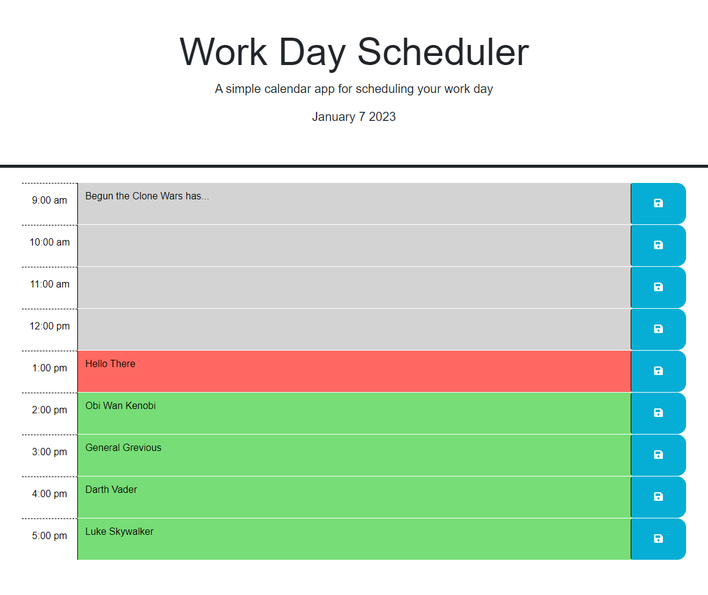

# Work Day Scheduler

## Description

A simple work-day scheduler that utilizes jQuery, DayJS, and Bootstrap. Input is saved in local storage. 
This allows one to build a schedule to keep track of a busy work day.

## Usage

When the page loads, the current date is shown, and a set of times is given. If the time is in the past it will be colored gray.
If it's within the current hour the block will be colored red, and time in the future will be colored green.

When the user clicks on a box, text can be entered into the empty field. When the blue save button is clicked the input will be saved in local storage.
Even if the user refreshes the page the text that was input will still appear in the correct time field.

[Click Here to Open Application](https://jminor90.github.io/workday-scheduler/)

## Credits

Major edits to code by Joshua Minor

[Starter Code Cloned from Coding-Bootcamp Repo](https://github.com/coding-boot-camp/crispy-octo-meme)

[jQuery](https://jquery.com/)

[DayJS](https://day.js.org/)

[jQuery UI](https://jqueryui.com/)

[BootStrap](https://getbootstrap.com/)

[StackOverflow](https://stackoverflow.com/)

## License

MIT License see LICENSE for more details.
